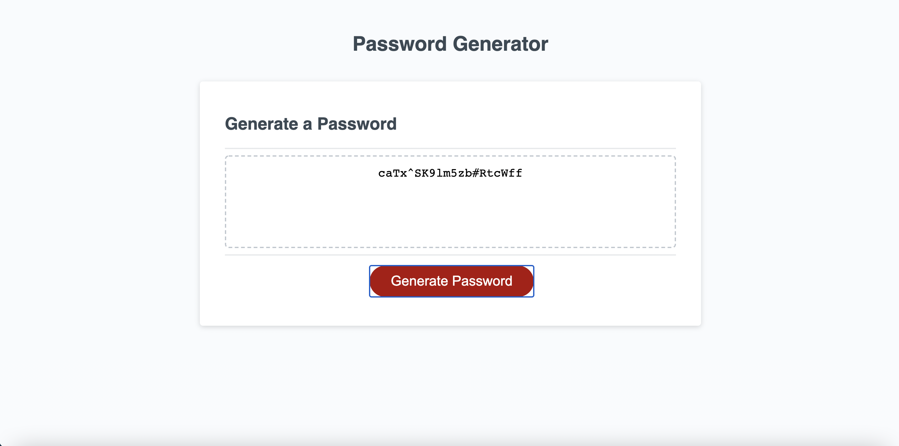

# Password-Generator

## Acceptance Criteria

```
GIVEN I need a new, secure password
WHEN I click the button to generate a password
THEN I am presented with a series of prompts for password criteria
WHEN prompted for password criteria
THEN I select which criteria to include in the password
WHEN prompted for the length of the password
THEN I choose a length of at least 8 characters and no more than 128 characters
WHEN prompted for character types to include in the password
THEN I choose lowercase, uppercase, numeric, and/or special characters
WHEN I answer each prompt
THEN my input should be validated and at least one character type should be selected
WHEN all prompts are answered
THEN a password is generated that matches the selected criteria
WHEN the password is generated
THEN the password is either displayed in an alert or written to the page
```
## Process

I started by creating variables for what the user could include in their password. I then created a function that would prompt the user for password length, and if they would like to include lower case letters, upper case letters, numbers and special characters. I made sure the user choose within the accepted criteria by adding if statement. once the user chose the length and contents of their password, I added it into and empty array and called a function that ran a for loop through the created array for the length that the user chose.

## Site screenshot



## Link to site
https://jeffgcameron.github.io/Password-Generator/